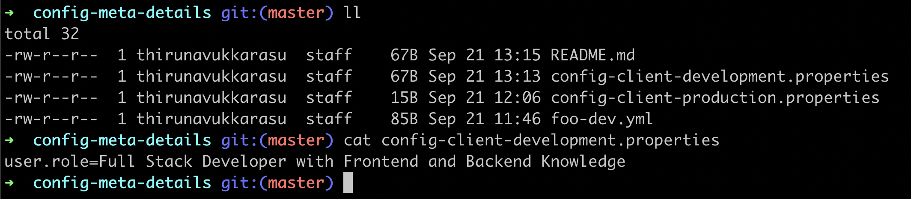
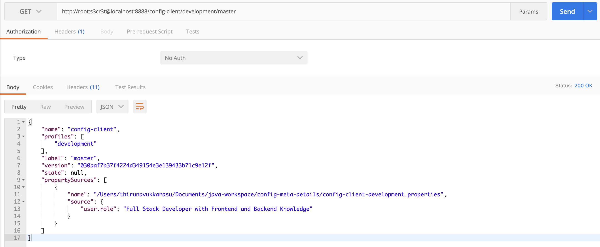
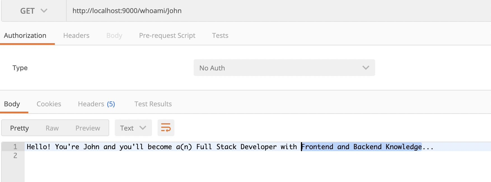
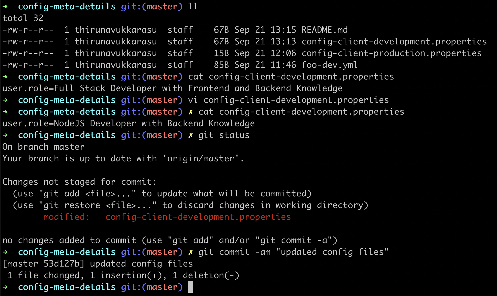
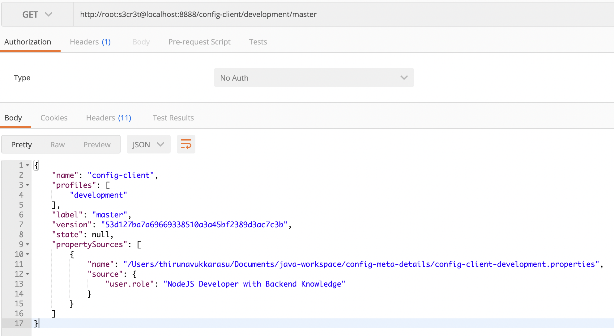
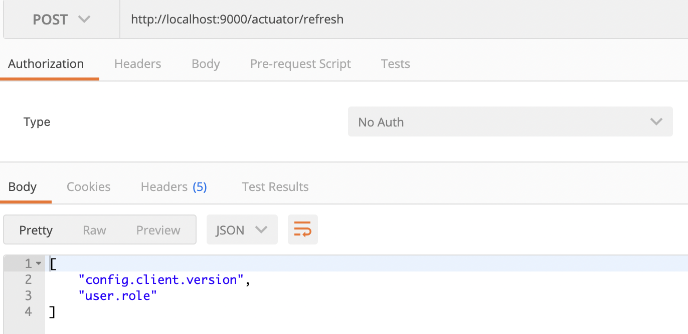
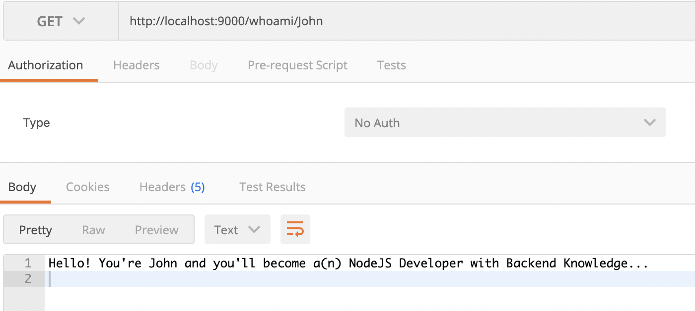
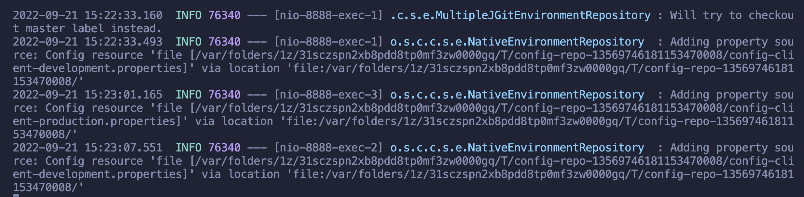

# Spring Cloud Config

Step 1 - Git Repo File Content

Step 2 - Spring Cloud Config Server API Response

Step 3 - Spring Cloud Config Client API Response

Step 4 - Git Repo File Content (Modified)

Step 5 - Spring Cloud Config Server API Response (Modified)

Step 6 - Spring Actuator Refresh Bean Only

Step 7 - Spring Cloud Config Client API Response(Modified)

Step 8 - Spring Cloud Config Server Fetching File from local github repo file
