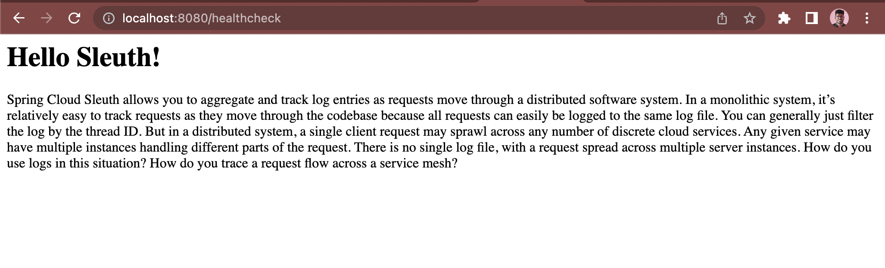
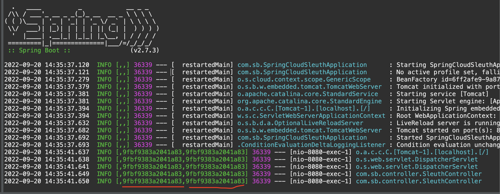

# Spring Cloud Sleuth 

### Current Scenario(With Log4j/Logback/Log4j2)
***

We've all had the unfortunate experience of trying to diagnose a problem with a scheduled task, a multi-threaded operation, or a complex web request. Often, even when there is logging, it is hard to tell what actions need to be correlated together to create a single request. 

### Painpoints:
***
This can make diagnosing a complex action very difficult or even impossible. Often resulting in solutions like passing a unique id to each method in the request to identify the logs.

### To The Rescue:
***

In comes Sleuth. This library makes it possible to identify logs pertaining to a specific job, thread, or request. Sleuth integrates effortlessly with logging frameworks like Logback and SLF4J to add unique identifiers that help track and diagnose issues using logs.

### Spring Sleuth Scenarios
1. Simple Web Request
2. Simple Web Request With Service Access
3. Manually Adding a Span
4. Spanning Runnables
5. @Async Support
6. @Scheduled Support

You can see in the below screenshot while hitting the API endpoint `/healthcheck` the log is getting printed with TraceID and default SpanID as well.
### REST API Endpoint 

### Application Logs

Thanks to Baeldung for this amazing article. 
### Credits & References

1. https://www.baeldung.com/spring-cloud-sleuth-single-application